# HTML Artifact 20 個範例工作流整理

來源：

- The unreasonable effectiveness of HTML examples：<https://thariqs.github.io/html-effectiveness/>
- 相關背景文章：<https://x.com/trq212/status/2052809885763747935>

## 這篇文章主要在講什麼

這個頁面是「The unreasonable effectiveness of HTML」的範例集。它整理了 20 個由 agent 產生的單檔 `.html` 範例，主張在很多工程工作裡，HTML artifact 可以取代一大段很少人會讀完的 Markdown。

重點不是「HTML 比 Markdown 高級」，而是：當你需要比較、理解、展示、互動、調參、排序、回饋或分享時，HTML 可以把資訊變成一個可閱讀、可點擊、可操作的工作介面。

## 為什麼需要這個概念

在真實工作裡，AI agent 很常產生長篇 Markdown：implementation plan、PR summary、研究報告、incident report、設計討論。Markdown 很適合保存文字，但有幾個常見瓶頸：

- 多方案比較時，讀者要在腦中切換上下文。
- code review 的 diff、call graph、風險標註很難只靠文字表達。
- 設計稿、動畫、互動流程很難用描述代替體感。
- 報告與 post-mortem 若只有長文，很多人只會快速略過。
- 有些工作其實需要一個小型操作介面，例如票卡排序、feature flag 編輯、prompt tuning。

HTML artifact 的價值，就是把 agent 的輸出從「文字文件」升級成「一次性的工作介面」。

## 學完這篇你應該會做到什麼

讀完後，你應該能做到：

- 判斷什麼時候該請 agent 產生 HTML，而不是 Markdown。
- 看懂來源頁面 9 類範例各自適合的工作情境。
- 寫出能讓 agent 產生有用 HTML artifact 的 prompt。
- 知道 HTML artifact 交付前要檢查什麼。
- 避免把 HTML 變成只有視覺裝飾、沒有工程價值的頁面。

## 來源範例分類總覽

| 類別 | 範例數 | 來源頁面的用途 |
| --- | ---: | --- |
| Exploration & Planning | 3 | 多方案探索、視覺方向比較、implementation plan |
| Code Review & Understanding | 3 | annotated PR、PR writeup、module map |
| Design | 2 | design system、component variants |
| Prototyping | 2 | animation sandbox、clickable flow |
| Illustrations & Diagrams | 2 | SVG figure sheet、annotated flowchart |
| Decks | 1 | arrow-key slide deck |
| Research & Learning | 2 | feature explainer、concept explainer |
| Reports | 2 | weekly status、incident timeline |
| Custom Editing Interfaces | 3 | ticket triage、feature flag editor、prompt tuner |

> 筆記閱讀方式：上表只保留分類速查。20 個 `.html` 內部範例會放在各自對應的 Use Case 章節底下，讓讀者讀到哪一類工作流，就能立刻看到該類範例、適用情境與學習重點。

## 定義名稱對照表

| 角色 | 文章中的名稱 | 功能 / 責任 |
| --- | --- | --- |
| HTML artifact | self-contained `.html` file | Agent 產生的單檔 HTML，可用瀏覽器直接開啟 |
| Agent | agent / Claude Code | 讀取上下文並產生文件、圖表、互動介面或分析結果 |
| 使用者 | reviewer / developer / team | 閱讀、比較、操作、驗證與回饋 artifact 的人 |
| Export button | copy markdown / copy diff / copy prompt | 把使用者在 HTML 裡的操作結果匯出成可貼回工作流的文字 |
| 工作替代物 | wall of markdown | 原本可能是一大段 Markdown 的規格、報告、說明或清單 |

## 實務使用情境

適合使用 HTML artifact 的情境：

- 需要比較多個方案，例如技術做法、UI layout、實作路線。
- 需要理解一個複雜 PR、陌生模組或資料流。
- 需要展示 design tokens、component variants 或互動原型。
- 需要用圖表、流程圖、時間線、狀態顏色提升閱讀效率。
- 需要讓使用者調參、拖拉、篩選、標註，最後匯出結果。

不適合使用的情境：

- 只需要短摘要、待辦清單或純文字記錄。
- 文件需要長期維護，而且團隊主要用 git diff review。
- HTML 沒有增加比較、互動、視覺化或分享價值。
- 內容包含敏感資料，且你不確定 HTML 會被放在哪裡。
- 團隊還沒有能力檢查 agent 產生的 HTML 是否引用正確資料。

## Use Case 1：Exploration & Planning

### 這篇文章主要在講什麼

這類範例用在「你還不確定方向」的時候。來源頁面列出 three code approaches、visual design directions、implementation plan。它的目的不是直接給唯一答案，而是把多個方向並排，讓你能比較 trade-off，再把選中的方向轉成可執行計畫。

### 為什麼需要這個概念

如果 agent 只用 Markdown 逐段列出三個方案，讀者很容易讀到第二個就忘了第一個。HTML 可以把方案變成 side-by-side card、比較表、timeline、mockup、風險表，讓你用眼睛比較。

### 學完這篇你應該會做到什麼

你應該能請 agent 產出一份探索頁，包含多方案比較、各方案風險、推薦方向與後續 implementation plan。

### 核心重點

- 用 HTML 的版面能力把選項並排。
- 每個方案都要有 trade-off，不要只列優點。
- 選定方向後，應該能延伸成 milestones、data flow、risk table。

### 來源內部範例整理

| 來源範例 | 範例本體在做什麼 | 頁面怎麼組 | 這個 Case 要學的重點 |
| --- | --- | --- | --- |
| [Three code approaches](https://thariqs.github.io/html-effectiveness/01-exploration-code-approaches.html) | 用「task filter input 的 debounced search」當題目，比較三種做法：直接在 component 裡用 `useEffect + setTimeout`、抽成 `useDebounce` hook、改用外部 debounce library。 | 每個方案都有程式碼片段、優缺點、bundle impact、testability、reuse、SSR safety，最後明確推薦 custom hook。 | 技術探索不是列方案而已，要把成本、複用性、測試性、依賴風險都放在同一個閱讀面上，讓決策自然浮出來。 |
| [Visual design directions](https://thariqs.github.io/html-effectiveness/02-exploration-visual-designs.html) | 用「no tasks yet」empty state 當題目，做出 minimal、illustrated、playful、instructional 四種視覺方向。 | 每個方向都有標題、文案、CTA、視覺語氣說明，並能對照 light / dark surface。 | 設計探索要讓人「看見並比較」，而不是只讀形容詞；不同方向要對應不同使用者情境。 |
| [Implementation plan](https://thariqs.github.io/html-effectiveness/16-implementation-plan.html) | 用「task cards 加 threaded comments」當題目，產出可交給實作者的計畫。 | 有 effort、touched surfaces、feature flag、milestones、data flow、mockups、migration SQL、optimistic mutation code、risks、open questions。 | 好的 implementation plan 要把需求拆成可 review 的 slices，並同時交代資料流、UI、程式碼風險與 rollout。 |

#### 範例內文整理：Three code approaches

這個範例的題目是「task filter input 要做 debounced search」。它不是只說 debounce 是什麼，而是把三種可行實作放在同一頁比較。

第一種做法是直接在 `TaskSearch` component 裡用 `useEffect` 和 `setTimeout`。它的好處是沒有新抽象、容易用 devtools 追、bundle 不增加；缺點是邏輯會散在每個 search input 裡，同一個概念需要兩份 state，延遲時間也藏在 component 內。這種做法適合一次性、小範圍、不會重複使用的搜尋欄。

第二種做法是抽出 `useDebounce<T>(value, ms)` hook，放在 `src/hooks/`。它把 timer 邏輯集中管理，讓 task filter、command bar、member picker 都能共用；也比較容易用 fake timers 做單元測試。範例最後推薦這個方案，因為 Birchline 已經有三個地方手寫類似邏輯，抽 hook 可以移除重複，又不需要引入新 dependency。

第三種做法是使用 `use-debounce` 外部套件。它支援 leading、trailing、maxWait、flush、cancel 等較完整語意，也能減少自己處理 edge cases 的負擔；但代價是多一個 runtime dependency，需要審查、更新，也會增加 bundle。範例提醒：只有當需求真的長出 `maxWait` 或 `flush()` 這類語意時，外部套件才比較值得。

這個範例值得學的是：技術方案比較不要只看「哪個最漂亮」，要同時看是否重複、是否容易測、是否增加依賴、是否符合現有 codebase 風格。

#### 範例內文整理：Visual design directions

這個範例的題目是「no tasks yet」空狀態要怎麼設計。它把同一個 empty state 做成四種方向，而不是只產出一個看似最佳的版本。

Minimal 方向使用很少文字和單一 action，語氣安靜、穩定，適合產品周圍介面已經很有個性的情境。Illustrated 方向加入幾何插圖，讓使用者理解「list 裡會有 tasks」這個物件模型。Playful 方向用比較輕鬆的文案和微動態，讓空狀態不那麼冰冷，但要控制 motion 不要干擾使用者。Instructional 方向把空狀態當 onboarding，直接列出建立 task、加 due date、邀請 teammate 的步驟，資訊密度較高，適合新使用者第一次進來。

這個範例值得學的是：視覺探索不是在選「哪個最美」，而是在比較「哪個語氣最適合目前使用者狀態」。同一個空畫面，對熟手使用者可能該安靜，對新手使用者可能該教學。

#### 範例內文整理：Implementation plan

這個範例的題目是「在 task card 加 threaded comments」。頁面一開始先列出 implementation plan 的摘要：預估約兩週、會碰到三個 packages、新增兩張資料表、用 `task_comments_v1` feature flag 控制。

Milestones 被切成四個可 review 的 slices。第一段先做 schema 和 API contract，新增 `comments`、`comment_reads` tables、migration 和 router stubs，先不碰 UI。第二段做 `<CommentThread>` 和 composer，用 fixtures 渲染靜態畫面，送出時先 optimistic insert，失敗時 rollback，並限制只支援一層 nesting。第三段做 realtime fan-out 和 unread state，讓開著 task card 的使用者能即時收到 comments，並用 read cursor 記錄未讀。第四段做 mention notification、email digest fallback、feature flag ramp 和文件。

Data flow 把 optimistic write path 和 realtime fan-out 分開看。左邊是 composer submit、React Query cache optimistic insert、tRPC `comments.create`、Postgres insert、temp id reconcile；右邊是 realtime channel broadcast 和 notification worker。這裡重要的是：畫面渲染不等待 fan-out，所以使用者互動會快。

Key code 特別放了兩段容易出錯的地方：migration 和 optimistic mutation。Migration 裡有 `comments` 和 `comment_reads`，支援 soft delete、parent comment、read cursor 和 task-created index。前端 hook 則示範 temp id、pending row、成功後把 temp id 換成 real id、失敗後移除 optimistic row。

Risks & mitigations 把風險列成表格，例如 HTTP response 和 socket append 可能競賽造成 duplicate、跨裝置 read cursor 可能 stale、mention detection 可能誤判。每個風險都附 mitigation。最後 open questions 不是空泛問題，而是具體決策：要不要允許 edit、email digest cadence 如何設計。

這個範例值得學的是：implementation plan 應該能被實作者直接拿去切 PR，不只是高層大綱。它需要 milestone、資料流、mockup、關鍵程式碼、風險、未決問題一起出現。

#### 圖示與 code 補充：Exploration & Planning

Three code approaches 的決策圖：

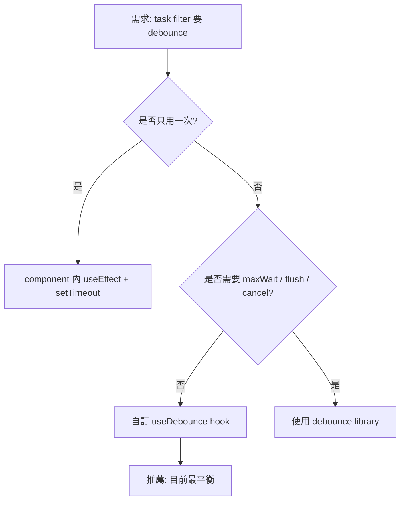

Three code approaches 的 code 骨架：

```tsx
// 範例用途：把 debounce 邏輯抽成 hook，讓多個搜尋欄共用。
// 主要輸入：
// - value：使用者目前輸入的關鍵字。
// - delayMs：等待多久才把值交給真正查詢流程。
// 回傳結果 / 副作用：
// - 回傳延遲後的 debouncedValue，避免每打一個字就打 API。
export function useDebounce<T>(value: T, delayMs: number): T {
  const [debouncedValue, setDebouncedValue] = useState(value);

  useEffect(() => {
    const timerId = window.setTimeout(() => {
      setDebouncedValue(value);
    }, delayMs);

    return () => window.clearTimeout(timerId);
  }, [value, delayMs]);

  return debouncedValue;
}

function TaskSearch({ onSearch }: { onSearch: (query: string) => void }) {
  const [query, setQuery] = useState("");
  const debouncedQuery = useDebounce(query, 250);

  useEffect(() => {
    onSearch(debouncedQuery);
  }, [debouncedQuery, onSearch]);

  return <input value={query} onChange={(event) => setQuery(event.target.value)} />;
}
```

Visual design directions 的比較圖：

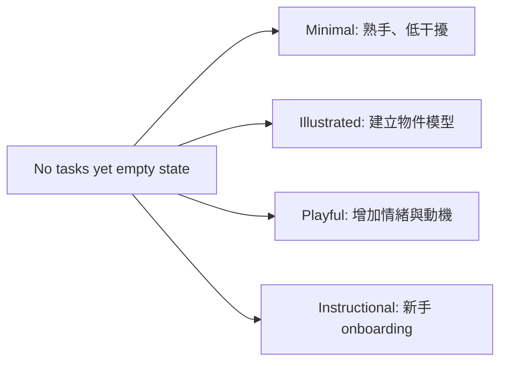

Visual design directions 的 UI 骨架：

```html
<!-- 範例用途：用同一份 empty state 資料渲染不同語氣方向。 -->
<section class="empty-state empty-state--instructional">
  <h2>No tasks yet</h2>
  <p>Start by creating your first task, adding a due date, then inviting a teammate.</p>
  <ol>
    <li>Create a task</li>
    <li>Add schedule and priority</li>
    <li>Invite a teammate</li>
  </ol>
  <button type="button">Create task</button>
</section>
```

Implementation plan 的主流程圖：

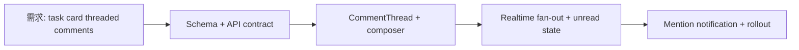

Implementation plan 的 DB / optimistic mutation 骨架：

```sql
-- 範例用途：threaded comments 的最小資料結構。
-- 主要輸入：task_id、author_id、body、parent_comment_id。
-- 副作用：新增 comments row，並用 comment_reads 記錄使用者讀到哪裡。
create table comments (
  id uuid primary key,
  task_id uuid not null,
  author_id uuid not null,
  parent_comment_id uuid null references comments(id),
  body text not null,
  created_at timestamptz not null default now(),
  deleted_at timestamptz null
);

create table comment_reads (
  task_id uuid not null,
  user_id uuid not null,
  last_read_comment_id uuid null,
  updated_at timestamptz not null default now(),
  primary key (task_id, user_id)
);
```

```tsx
// 範例用途：送出 comment 時先 optimistic insert，讓 UI 不必等 server。
// 主要輸入：taskId 與 body。
// 副作用：暫時把 pending comment 放進 cache；失敗時 rollback。
function useCreateComment(taskId: string) {
  const queryClient = useQueryClient();

  return useMutation({
    mutationFn: (body: string) => commentsApi.create({ taskId, body }),
    onMutate: async (body) => {
      await queryClient.cancelQueries({ queryKey: ["comments", taskId] });
      const previous = queryClient.getQueryData<Comment[]>(["comments", taskId]) ?? [];

      const pendingComment: Comment = {
        id: `temp-${crypto.randomUUID()}`,
        taskId,
        body,
        status: "pending",
      };

      queryClient.setQueryData(["comments", taskId], [...previous, pendingComment]);
      return { previous };
    },
    onError: (_error, _body, context) => {
      queryClient.setQueryData(["comments", taskId], context?.previous ?? []);
    },
    onSettled: () => {
      queryClient.invalidateQueries({ queryKey: ["comments", taskId] });
    },
  });
}
```

這三個範例串起來，其實就是一條完整探索路線：先展開技術或設計選項，再選方向，最後變成可執行計畫。讀這個 Case 時，不要只記「可以做 HTML 比較頁」，要學它怎麼把「模糊問題」一路推進到「可交付任務」。

### 真實工作流程例子

- 工作任務：PM 說「我們要重做 onboarding，但還不確定要走快速註冊、教學導覽還是任務清單」。你要請 agent 產出 6 個方向讓團隊比較。
- 你先判斷：這不是要立刻實作，而是要降低討論成本，所以輸出應該是探索 artifact，不是正式設計稿。
- 會動到：產品需求、現有 onboarding 頁面、使用者角色、競品截圖、`onboarding-exploration.html`。
- 資料怎麼流：需求與現有畫面進入 agent，agent 產出 HTML 比較頁，團隊選定方向，再把方向轉成 implementation plan。
- 流程路線圖：

```text
PM 模糊需求 -> agent 讀現有上下文 -> 產生多方案 HTML
-> 團隊比較 trade-off -> 選定方向 -> 產生實作計畫
```

- 工作中會寫 / 檢查的片段：

```text
請產生 onboarding-exploration.html。
請做 6 個不同方向，並排呈現，每個方向包含：
- 適合的使用者情境
- 優點
- 風險
- 需要修改的前端元件
- 對後端 API 的影響
最後加一張推薦決策表。
```

- 交付前驗證：確認每個方案真的不同；確認每個方案都有風險；確認推薦方向能轉成下一步任務。
- 常見卡點：junior 容易要求「多給幾個方案」，但沒有要求比較維度，導致結果只是風格不同而不是決策不同。

### 範例範圍地圖

| 部分 | 位置 / 檔案 / 指令 / 介面 | 負責的事情 |
| --- | --- | --- |
| 需求來源 | PM brief、issue、現有頁面 | 定義要探索的問題 |
| HTML artifact | `onboarding-exploration.html` | 並排顯示多個方向 |
| 後續交付 | implementation plan、ticket 拆分 | 把選定方向變成任務 |

### 完整實作流程、範例與注意事項

1. 先定義要探索的問題與限制條件。
2. 要求 agent 產生多個「真的不同」的方向。
3. 指定比較維度，例如開發成本、使用者摩擦、API 影響、風險。
4. 要求 HTML 用 grid、table、mockup 或 timeline 呈現。
5. 會議後把選中的方向請 agent 轉成 plan。

注意事項：探索 artifact 不要假裝已經是最終規格；它是決策工具。

### 如果結果和預期不同

如果結果太像裝飾圖，補一句：「請以工程決策為主，每個方案都要列出會修改的檔案、API 影響與風險。」

### 當天做完後檢查

- 是否能看出每個方案差異。
- 是否有 trade-off。
- 是否能把選定方案轉成下一步。

### 負面例子 / 錯誤用法

錯誤做法：只叫 agent「做漂亮的探索頁」。  
問題：漂亮不等於可決策。  
修正方向：要求比較維度、限制條件、風險與推薦理由。

### 小練習

拿一個你正在猶豫的功能，請 agent 產出 3 個方案比較 HTML，並要求每個方案列出「會改哪些檔案」。

### Junior 常見誤解

誤以為探索就是腦力激盪。實務上，好的探索要能縮小選項，最後變成可執行 plan。

### 一句話總結

Exploration HTML 的目標是讓團隊更快看見選項差異，並把討論收斂成下一步。

## Use Case 2：Code Review & Understanding

### 這篇文章主要在講什麼

這類範例包含 annotated pull request、PR writeup、module map。它把 diff、call graph、模組關係和 review 重點視覺化，讓 reviewer 不必只靠 GitHub diff 或一大段 PR 描述理解改動。

### 為什麼需要這個概念

Code review 常見問題是 reviewer 只看到片段 diff，看不到資料流與風險位置。HTML 可以把 diff、註解、嚴重度、跳轉連結、模組圖放在一起。

### 學完這篇你應該會做到什麼

你應該能請 agent 產出一份 PR review artifact，讓 reviewer 快速看懂「改了什麼、為什麼改、風險在哪裡、該測什麼」。

### 核心重點

- Diff 是空間資訊，HTML 比純文字更適合標註。
- Module map 能幫助 reviewer 看到入口、核心路徑與依賴。
- PR writeup 應該引導 reviewer 聚焦，而不是只重複 commit。

### 來源內部範例整理

| 來源範例 | 範例本體在做什麼 | 頁面怎麼組 | 這個 Case 要學的重點 |
| --- | --- | --- | --- |
| [Annotated pull request](https://thariqs.github.io/html-effectiveness/03-code-review-pr.html) | 用 PR #247「task list mutations 加 optimistic updates」當 review 題目。範例指出新增 `useOptimisticTasks` hook、TaskList 改成即時更新、API 加 idempotency key。 | 先列 PR 做了什麼，再用 risk map 分檔案，對 diff 行號加 blocking / nit 註解，最後列 suggested next steps。 | HTML review 不只是摘要，它要直接指出 reviewer 該看哪一行、為什麼有風險、下一步怎麼修。 |
| [PR writeup for reviewers](https://thariqs.github.io/html-effectiveness/17-pr-writeup.html) | 用 PR #312「notification delivery 移到 queue」當作者說明，解釋為什麼 inline send 造成 latency 與可靠性問題。 | 有 TL;DR、Before / After、file-by-file tour、review focus、test plan、rollout plan。 | PR writeup 的核心不是列檔案，而是替 reviewer 建立脈絡，告訴他哪裡最值得花時間。 |
| [Module map](https://thariqs.github.io/html-effectiveness/04-code-understanding.html) | 用 auth flow 當陌生模組理解題，說明 cookie session 怎麼從 browser 經 `/api/session`、`verifyToken()`、`SessionStore` 到 Postgres。 | 有 request path、callstack walkthrough、關鍵檔案、gotchas，例如 LRU cache 是 per-process、日期比較要注意型別。 | 理解模組時，HTML 可以把 entry point、信任邊界、資料儲存與 gotchas 放在同一張地圖上。 |

#### 範例內文整理：Annotated pull request

這個範例整理 PR #247「task list mutations 加 optimistic updates」。頁面先用短摘要說明 PR 目標：把原本 await server response 再 refetch 的模式，改成先在 React Query cache 做 optimistic write，讓使用者切換或排序 task 時不用等約 300ms round trip。

範例把檔案依風險分成 safe、worth a look、needs attention。最需要看的檔案是 `useOptimisticTasks.ts`，因為它新增 mutation wrapper、snapshot previous list、error rollback。頁面在 diff 旁邊直接標註 blocking 問題：`onMutate` 沒有先 `cancelQueries`，如果背景 refetch 在 optimistic write 和 server response 中間回來，UI 可能閃回舊資料。

另一個 blocking 問題在 `api/tasks.ts`：idempotency key 如果用 default parameter 每次 retry 都重新產生，就失去 idempotency 的意義。這種 review 註解很有價值，因為它不是說「這裡怪怪的」，而是說清楚 race condition 或 retry semantics 會怎麼壞。

範例最後列 suggested next steps：在 `onMutate` 開頭取消查詢、把 idempotency key 生成移到 mutation context、處理沒用到的 `isPending`。這讓 reviewer 的意見可以直接變成作者下一步。

#### 範例內文整理：PR writeup for reviewers

這個範例整理 PR #312「notification delivery 移到 queue」。TL;DR 說明原本 notification send 發生在 request path，負載高時會讓 mutation latency 增加，也可能因 SMTP pool 滿而掉信。改成 queue 之後，API handler 只 enqueue job 就回應，worker 負責 retry 和 dead-letter。

Why 小節補了背景：comment mention 上線後，每個 mention 可能觸發 in-app、email、Slack 三種通知；當一個 task update fan out 到很多 watchers，inline send 就不再適合。Before / After 對照讓 reviewer 很快看見行為變化：從 inline send、SMTP timeout 變 500、無 retry，變成 enqueue、worker retry、dead-letter inspection、p99 大幅下降。

File-by-file tour 不是照字母排序，而是照 reviewer 理解順序。先看 `worker.ts`，因為它是新核心；再看 comments router 裡 enqueue 的地方；接著看 dead-letter migration、adapter interface、worker process 註冊與測試。每個檔案都說明「為什麼改」，不是只列「改了什麼」。

Where to focus your review 直接把 reviewer 注意力放到 retry / dead-letter boundary、singleton key、刻意沒做的事情。這很重要，因為好的 PR writeup 會保護 reviewer 的時間，讓他知道哪裡是 merge 風險，哪裡只是搬移或 plumbing。

#### 範例內文整理：Module map

這個範例在解釋 `birchline/web` 的 authentication flow。核心結論是：Birchline 使用 cookie-based sessions，browser 不直接持有 bearer token。每個 authenticated request 都通過 `/api/*`，由 `verifyToken()` middleware 驗證 cookie，解析成 `Session` row，後續 handler 從 `req.ctx` 讀 session。

Request path 從 browser 發 `GET /api/session` 開始。React `AuthProvider` 用 `credentials: 'include'` 讓 cookie 帶上，server route 本身很薄，只回傳 middleware 放在 `req.ctx.session` 的資料。真正的 trust boundary 是 `src/middleware/auth.ts`，它讀 signed cookie、問 `SessionStore`、成功就把 session 放進 request context，失敗就回 401。

`SessionStore` 是 read-through cache：先查 process 內 LRU，再查 Postgres。寫入和 revoke 直接進 DB，並清掉本機 cache。資料表 `sessions` 用 random session id 當 primary key，另有 `user_id` index 支援 sign out everywhere。

Gotchas 很實用：LRU 是 per-process，所以 revoke 只會清掉當前 process cache，其他 worker 最多可能在 TTL 內還看得到舊 session；`expiresAt` 是 timestamptz，driver 回 Date，重構時不能把它當 raw string 比較。

#### 圖示與 code 補充：Code Review & Understanding

Annotated pull request 的 review 流程圖：

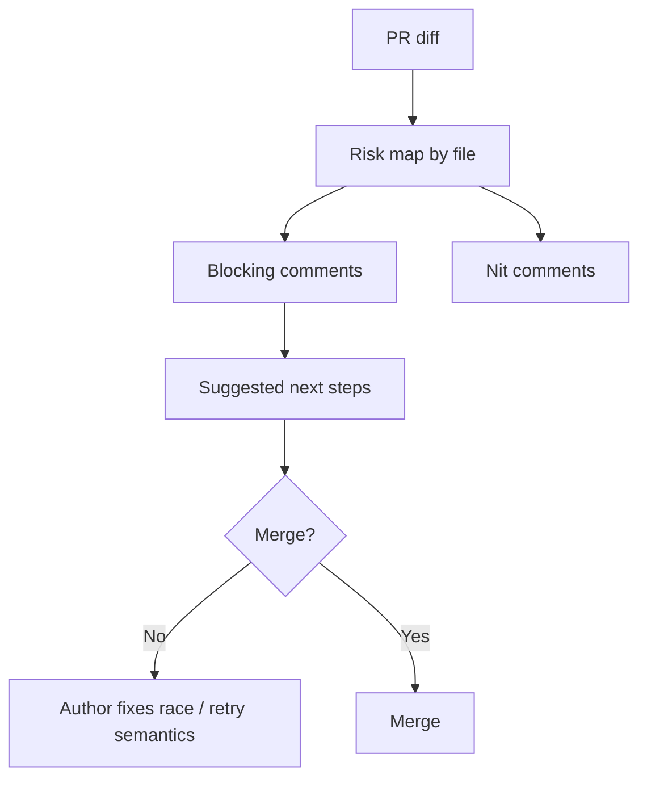

Annotated pull request 的 optimistic update 問題骨架：

```tsx
// 範例用途：標出 review 中最常見的 optimistic update race。
// 問題：如果沒有 cancelQueries，背景 refetch 可能蓋掉 optimistic cache。
const updateTask = useMutation({
  mutationFn: tasksApi.update,
  onMutate: async (patch) => {
    await queryClient.cancelQueries({ queryKey: ["tasks"] });
    const previous = queryClient.getQueryData<Task[]>(["tasks"]) ?? [];

    queryClient.setQueryData<Task[]>(["tasks"], (current = []) =>
      current.map((task) => task.id === patch.id ? { ...task, ...patch } : task)
    );

    return { previous };
  },
  onError: (_error, _patch, context) => {
    queryClient.setQueryData(["tasks"], context?.previous ?? []);
  },
});
```

PR writeup 的 notification queue 圖：

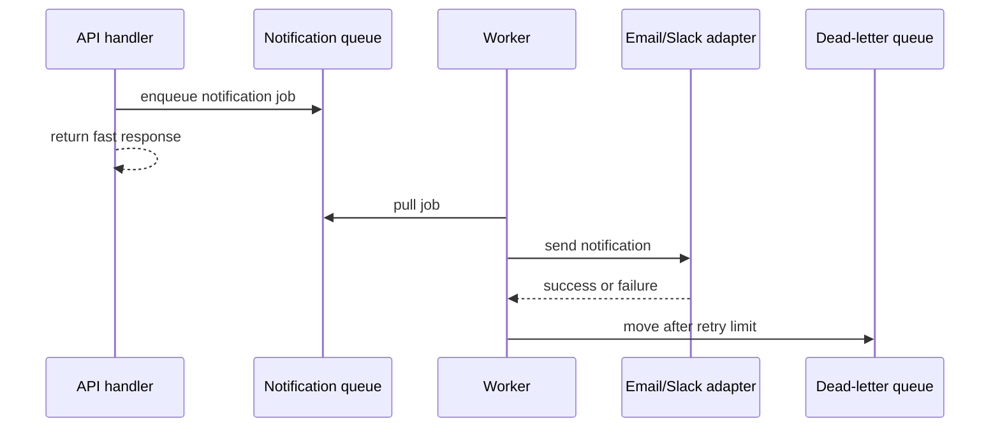

PR writeup 的 worker code 骨架：

```ts
// 範例用途：把通知寄送移出 request path。
// 主要輸入：queue 裡的 notification job。
// 副作用：寄送通知；重試失敗後移到 dead-letter queue。
async function processNotificationJob(job: NotificationJob) {
  try {
    await notificationAdapter.send({
      userId: job.userId,
      channel: job.channel,
      template: job.template,
      payload: job.payload,
    });

    await queue.ack(job.id);
  } catch (error) {
    if (job.attempts >= 5) {
      await deadLetterQueue.push({ ...job, error: String(error) });
      await queue.ack(job.id);
      return;
    }

    await queue.retry(job.id, { delayMs: backoff(job.attempts) });
  }
}
```

Module map 的 auth flow 圖：

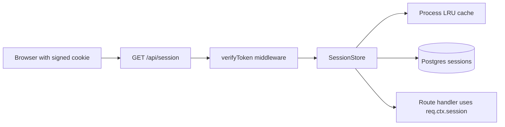

Module map 的 middleware 骨架：

```ts
// 範例用途：把 signed cookie 轉成 request context 裡的 session。
// 主要輸入：request cookie。
// 回傳結果 / 副作用：成功時設定 req.ctx.session，失敗時回 401。
async function verifyToken(req: Request, res: Response, next: NextFunction) {
  const sessionId = readSignedCookie(req, "session");
  if (!sessionId) {
    res.status(401).json({ error: "Missing session" });
    return;
  }

  const session = await sessionStore.get(sessionId);
  if (!session || session.expiresAt <= new Date()) {
    res.status(401).json({ error: "Invalid session" });
    return;
  }

  req.ctx = { ...req.ctx, session };
  next();
}
```

這三個範例的差異是：第一個幫你看 diff，第二個幫你寫 PR 脈絡，第三個幫你理解模組形狀。不要混在一起要求，最好先問自己「現在卡的是 review、說明，還是理解架構」。

### 真實工作流程例子

- 工作任務：你改了一個 payment retry PR，想讓 reviewer 快速理解 retry policy、錯誤碼與 idempotency 風險。
- 你先判斷：先判斷 reviewer 需要理解的是資料流與風險，不只是逐檔看 diff。
- 會動到：`git diff`、付款 service、retry 設定、測試檔、`payment-pr-review.html`。
- 資料怎麼流：agent 讀 diff 和相關檔案，產生 annotated HTML，reviewer 依照 HTML 聚焦檢查 PR。
- 流程路線圖：

```text
PR diff -> agent 分析改動 -> HTML 顯示 diff + 風險 + module map
-> reviewer 檢查高風險區 -> 留 comment / approve
```

- 工作中會寫 / 檢查的片段：

```text
請建立 payment-pr-review.html：
- 左側顯示檔案列表與風險等級
- 中間顯示主要 diff
- 右側用 margin notes 解釋 retry 與 idempotency
- 加一個測試清單：成功付款、暫時失敗、永久失敗、重複 callback
```

- 交付前驗證：抽查 HTML 內的 diff 是否對應真實 PR；確認測試清單至少涵蓋成功與失敗；確認嚴重度標籤不是亂猜。
- 常見卡點：junior 容易把 PR writeup 寫成「我改了哪些檔案」，但 reviewer 更需要知道「哪些地方最該看」。

### 範例範圍地圖

| 部分 | 位置 / 檔案 / 指令 / 介面 | 負責的事情 |
| --- | --- | --- |
| 原始資料 | `git diff`、PR description、測試結果 | 提供 review 事實來源 |
| 視覺說明 | annotated diff、module map | 幫 reviewer 看見風險 |
| 回饋出口 | GitHub PR comment | 把 review 結論帶回正式流程 |

### 完整實作流程、範例與注意事項

1. 先產生或取得 PR diff。
2. 請 agent 讀取相關模組，不要只讀 diff。
3. 要求 HTML 標示高風險檔案、資料流、測試缺口。
4. 打開 HTML 後逐項回到原始 diff 抽查。
5. 把最後結論貼回 PR。

注意事項：HTML review artifact 不能取代正式 code review，它只是幫 reviewer 更快找到該看的地方。

### 如果結果和預期不同

如果 HTML 只在講改了哪些檔案，要求它改成「以 reviewer 決策為中心」，列出 merge blocker、建議測試與不需花太多時間的檔案。

### 當天做完後檢查

- 是否有標示 reviewer focus。
- 是否有資料流或 module map。
- 是否能回到 PR 原始 diff 驗證。

### 負面例子 / 錯誤用法

錯誤做法：讓 agent 產生一份看似完整但沒有引用 diff 的 review 頁。  
問題：reviewer 會被漂亮頁面誤導。  
修正方向：每個重要結論都要能對應檔案、行為或測試。

### 小練習

找一個小 PR，請 agent 做一份 HTML PR writeup，要求它列出「reviewer 最該看的 5 個地方」。

### Junior 常見誤解

誤以為 PR 說明越長越好。真正好的 PR artifact 應該讓 reviewer 更快判斷風險。

### 一句話總結

Code review HTML 的價值，是把分散的 diff 變成 reviewer 能掃描、理解與驗證的地圖。

## Use Case 3：Design

### 這篇文章主要在講什麼

Design 類範例包含 living design system 和 component variants。來源頁面指出 HTML 本來就是設計系統常見的承載媒介，因此很適合呈現 tokens、色票、字級、spacing、元件狀態與 variants。

### 為什麼需要這個概念

Design token 如果只放 JSON 或 Markdown，工程師很難直覺理解實際效果。HTML 可以把 token 直接渲染成色票、字級表、元件狀態表。

### 學完這篇你應該會做到什麼

你應該能請 agent 從 repo 裡抽出 design tokens 或 component props，產出一份可檢查的設計系統 HTML。

### 核心重點

- Tokens 要被看見，不只是被列出。
- Component variants 要同頁比較尺寸、狀態、意圖。
- Artifact 可以反過來餵給 agent 作為後續設計參考。

### 來源內部範例整理

| 來源範例 | 範例本體在做什麼 | 頁面怎麼組 | 這個 Case 要學的重點 |
| --- | --- | --- | --- |
| [Living design system](https://thariqs.github.io/html-effectiveness/05-design-system.html) | 從 `src/styles/tokens.ts` 和 components 產生設計系統參考頁，列出 color、typography、spacing、radius、shadow、core components。 | 顏色不是只列 token 名稱，而是直接渲染 swatches；字級用實際文字展示；button、input、checkbox、badge 也被放進頁面。 | 設計系統筆記要能被「看」和「複製」，不能只是一份 token 清單。 |
| [Component variants](https://thariqs.github.io/html-effectiveness/06-component-variants.html) | 用 Birchline `<Card />` 做六種結構變體：flat、outlined、elevated、accent stripe、inset、horizontal。 | 有 padding、border、shadow 控制項，每張 card 都標出適合用途，例如 dense list、default content card、draggable item、sidebar row。 | Component variants 要把 props、狀態、適用情境綁在一起，這樣 review 時才知道哪個 variant 該保留或收斂。 |

#### 範例內文整理：Living design system

這個範例把 Birchline 的 design system 做成 portable reference。它明確標示來源是 `src/styles/tokens.ts` 和 `src/components/`，目的不是重新設計，而是把 repo 裡既有規則渲染出來，之後可以當作 prompting reference。

Color 區分 primary、neutral、semantic。Primary 包含 clay、slate、ivory、oat；neutral 包含 white、gray scale；semantic 包含 success、warning、danger、info。重點是每個 token 都用實際色塊呈現，讓人不用靠色碼想像。

Typography 用同一句文案展示 display、heading、body、small、caption 的字級、line-height、weight。Spacing 從 4 到 64，以 `--sp-*` 類 token 呈現。Radius 與 elevation 則列出不同圓角和 shadow token。

Core components 不是貼完整 component code，而是用 Button、Input、Checkbox、Badge 的實際狀態展示語氣，例如 create task、cancel、skip、delete、draft、in review、done、overdue。這讓 agent 或工程師後續做 UI 時能看見既有風格邊界。

#### 範例內文整理：Component variants

這個範例用 `<Card />` 當對象，做出六種結構處理：flat、outlined、elevated、accent stripe、inset、horizontal。頁面有 padding、border、shadow 控制項，讓你能調整 density 和 emphasis。

每個 variant 都不是只展示外觀，而是附上「best for」。Flat 適合 tinted background 上的 dense list；Outlined 適合 ivory 背景上的 default content cards；Elevated 適合 draggable items 和 popovers；Accent stripe 適合 pinned 或 priority items；Inset 適合白色 panel 內的 nested cards；Horizontal 適合 compact row lists 和 sidebars。

這個範例最值得學的是：component variant matrix 應該把外觀選項和使用情境綁在一起。否則團隊只會討論「哪張卡片好看」，不會知道什麼情況該用哪一種。

#### 圖示與 code 補充：Design

Living design system 的 token 地圖：

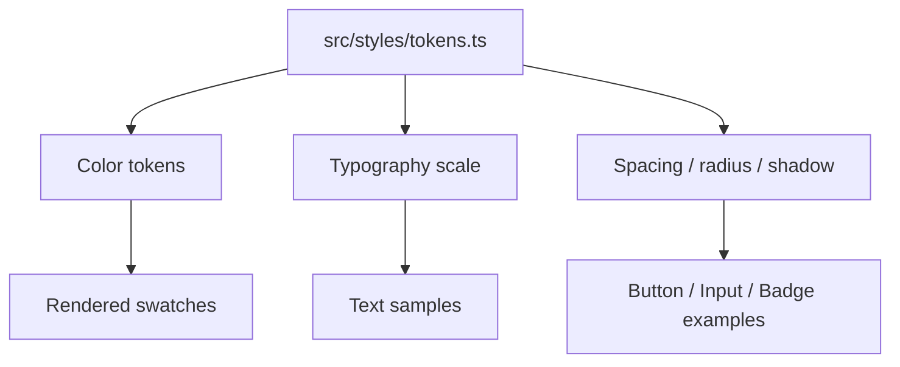

Living design system 的 token 片段：

```ts
// 範例用途：用設計 token 當 UI 的單一事實來源。
// 主要輸入：語意化 token 名稱。
// 副作用：讓 HTML artifact 和產品 UI 都能引用同一套視覺規則。
export const tokens = {
  color: {
    background: "#fbfaf7",
    surface: "#ffffff",
    text: "#1f2933",
    primary: "#8b5e3c",
    danger: "#c2410c",
  },
  spacing: {
    xs: "4px",
    sm: "8px",
    md: "16px",
    lg: "24px",
  },
  radius: {
    sm: "4px",
    md: "8px",
  },
};
```

Component variants 的選用決策圖：

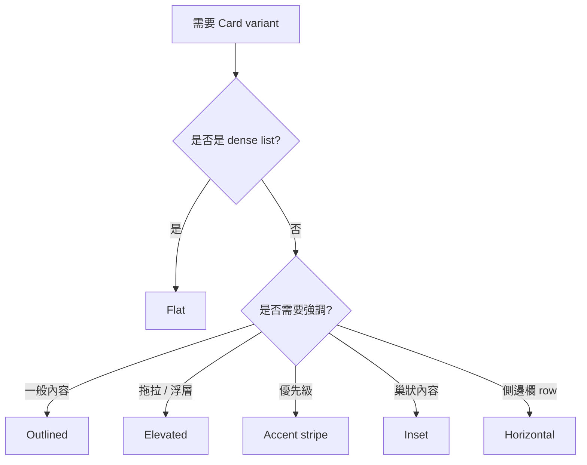

Component variants 的 props 骨架：

```tsx
// 範例用途：讓 Card 的視覺差異由 variant 控制，而不是到處手寫 class。
// 主要輸入：variant 與 density。
// 回傳結果：渲染符合設計系統的 card。
type CardVariant = "flat" | "outlined" | "elevated" | "accent" | "inset" | "horizontal";

function Card({ variant, children }: { variant: CardVariant; children: React.ReactNode }) {
  return (
    <article className={`card card--${variant}`}>
      {children}
    </article>
  );
}
```

這兩個範例最大的價值，是把原本藏在 CSS、tokens、component props 裡的規則變成可共同檢查的畫面。工程師和設計師就不必只對著 JSON 或 class name 討論。

### 真實工作流程例子

- 工作任務：設計師說 button 有太多狀態不一致，請你整理目前專案中 button variants。
- 你先判斷：這是設計系統盤點，不是立刻重構 component。
- 會動到：`Button.tsx`、CSS tokens、storybook 設定、`button-variants.html`。
- 資料怎麼流：agent 讀 component 與樣式設定，HTML 渲染所有 variants，設計師與工程師共同檢查差異。
- 流程路線圖：

```text
component + tokens -> agent 整理 variants -> HTML contact sheet
-> 設計 / 工程 review -> 決定收斂或新增規格
```

- 工作中會寫 / 檢查的片段：

```text
請讀取 Button component 與 design tokens。
產生 button-variants.html，列出：
- size: sm / md / lg
- intent: primary / secondary / danger
- state: default / hover / disabled / loading
每個 variant 要附上對應 class 或 token 名稱。
```

- 交付前驗證：確認 variant 有覆蓋真實 props；確認色票與 token 名稱一致；確認 disabled / loading 等狀態沒有漏。
- 常見卡點：junior 容易只截圖元件外觀，卻沒有保留 token 名稱與來源檔案，導致後續無法修正。

### 範例範圍地圖

| 部分 | 位置 / 檔案 / 指令 / 介面 | 負責的事情 |
| --- | --- | --- |
| 設計來源 | tokens、CSS variables、component props | 提供可渲染規格 |
| 呈現頁 | `button-variants.html` | 展示所有 variants |
| 決策輸出 | 設計系統 issue 或 task | 收斂不一致狀態 |

### 完整實作流程、範例與注意事項

1. 找出 component 與 token 來源。
2. 請 agent 列出所有 props 組合。
3. 產生 HTML contact sheet。
4. 對照真實 UI 或 Storybook。
5. 把不一致的 variant 轉成修正 task。

注意事項：不要把 agent 生成的 token 當成真實 token；要回到 repo 原始檔確認。

### 如果結果和預期不同

如果 HTML 顯示的樣式和實際產品不同，要求 agent 引用實際 CSS 或明確標示「推測樣式」。

### 當天做完後檢查

- 是否列出 token 名稱。
- 是否覆蓋所有重要狀態。
- 是否能讓設計師指出問題。

### 負面例子 / 錯誤用法

錯誤做法：讓 agent 隨意設計一套新 button。  
問題：這會偏離既有設計系統。  
修正方向：要求它讀取現有 tokens 與 component，再渲染目前狀態。

### 小練習

選一個元件，請 agent 產生 variants HTML，並標出每個 variant 對應的 props。

### Junior 常見誤解

誤以為 design artifact 是美術稿。工程工作裡，它更常是「盤點與對齊工具」。

### 一句話總結

Design HTML 把抽象 token 和 component props 變成團隊可以一起檢查的視覺表。

## Use Case 4：Prototyping

### 這篇文章主要在講什麼

Prototyping 類範例包含 animation sandbox 和 clickable flow。來源頁面強調 motion 和 interaction 很難只靠文字描述，應該用可操作的 HTML 讓人直接感受。

### 為什麼需要這個概念

互動體驗常常要「試了才知道」。Markdown 描述「快速變紫並播放動畫」不如一個可以調 duration、easing、delay 的 HTML sandbox。

### 學完這篇你應該會做到什麼

你應該能用 HTML 建立一次性 prototype，讓團隊在實作前調整互動感覺。

### 核心重點

- Prototype 不等於 production code。
- Slider、toggle、click-through 可以快速收斂需求。
- 最好提供 export，把調好的參數帶回實作。

### 來源內部範例整理

| 來源範例 | 範例本體在做什麼 | 頁面怎麼組 | 這個 Case 要學的重點 |
| --- | --- | --- | --- |
| [Animation sandbox](https://thariqs.github.io/html-effectiveness/07-prototype-animation.html) | 用「task completed」微互動當題目：點一下後圓圈填色、checkmark 畫出、label 刪除線、小慶祝效果、row 再收斂。 | 頁面讓你切換 easing，列出 keyframes 時序，並提供 copy-paste CSS。 | 動畫 prototype 要能測體感，也要留下可帶回正式實作的 CSS / timing。 |
| [Clickable flow](https://thariqs.github.io/html-effectiveness/08-prototype-interaction.html) | 用 sidebar drag-to-reorder 當題目，做一個不接後端、只存在 DOM 裡的拖拉排序原型。 | 列出 Inbox、Today、Upcoming 等 row，說明 drop indicator、drag ghost、grip affordance、刻意不做 auto-scroll / drop animation 的原因。 | Clickable prototype 要回答「手感對不對」，並把刻意省略的互動列成 open questions。 |

#### 範例內文整理：Animation sandbox

這個範例的題目是「task completed」微互動。它想讓使用者點完成 task 時感覺像一個小勝利：circle 填色、checkmark 畫出、label 加刪除線、小 burst 動畫，最後 row 變淡並安靜地退到背景。

頁面提供 easing 選項，例如 linear、ease-out、spring。它不是只列 CSS，而是讓使用者感覺不同 easing 對同一段動畫的影響。Keyframes 區列出時間順序：fill、check、strike、confetti、collapse，讓工程師知道每個子動畫何時發生。

Copy-paste CSS 區把正式可搬走的片段整理出來，例如 check circle settle animation、stroke-dashoffset 畫 checkmark、label strikethrough 從左到右長出來、row 完成後 delay 再淡出。這就是 prototype 的好做法：用一次性 HTML 調手感，但把可實作的 CSS 留下。

#### 範例內文整理：Clickable flow

這個範例的題目是「sidebar drag-to-reorder」。它明確說這是一個 throwaway HTML，用 native `dragstart / dragover / drop` 和約 40 行 JS 做，沒有 libraries。目的是在移植到 React 前先感覺 reorder 行為是否合理。

畫面列出 Inbox、Today、Upcoming、Projects、Archive、Trash 等 sidebar rows。排序只存在 DOM，重新整理就重置，表示它不是正式資料層實作。

What you're feeling 小節很有價值：drop indicator 不是跟著游標原始 Y，而是吸到最近 gap，跨過 row midpoint 才移動，避免抖動；dragged row 保留在原處但降低 opacity 並微微傾斜，讓使用者知道原位置；grip dots 是 affordance，但整列都可拖，避免 hit target 太小；auto-scroll 和 drop animation 刻意不做，先把核心手感判斷清楚。

Open questions 也很實用：Trash / Archive 要不要固定在底部、drop 後要不要 slide animation、鍵盤路徑是否用 `Alt + Arrow`。這表示 prototype 不是結論，而是幫團隊提出下一輪決策問題。

#### 圖示與 code 補充：Prototyping

Animation sandbox 的 keyframe 時序圖：

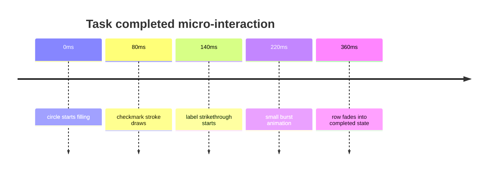

Animation sandbox 的 CSS 骨架：

```css
/* 範例用途：拆出 task complete 動畫的幾個可調參數。 */
.task-row[data-complete="true"] .checkmark {
  stroke-dasharray: 24;
  stroke-dashoffset: 24;
  animation: draw-check 180ms var(--task-easing, ease-out) forwards;
}

.task-row[data-complete="true"] .task-label {
  text-decoration-line: line-through;
  color: var(--muted-text);
  transition: color 180ms ease-out;
}

@keyframes draw-check {
  to {
    stroke-dashoffset: 0;
  }
}
```

Clickable flow 的 drag reorder 流程圖：

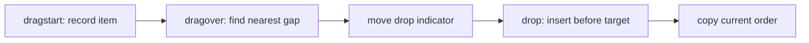

Clickable flow 的 DOM 操作骨架：

```js
// 範例用途：用最小 JS 測拖拉排序手感，不碰正式資料層。
let draggedItem = null;

document.querySelectorAll("[data-sidebar-item]").forEach((item) => {
  item.addEventListener("dragstart", () => {
    draggedItem = item;
    item.classList.add("is-dragging");
  });

  item.addEventListener("dragover", (event) => {
    event.preventDefault();
    const list = item.parentElement;
    const afterElement = findNearestGap(list, event.clientY);
    list.insertBefore(draggedItem, afterElement);
  });

  item.addEventListener("dragend", () => {
    draggedItem?.classList.remove("is-dragging");
    draggedItem = null;
  });
});
```

這兩個範例提醒我們：prototype 的重點不是程式碼可維護，而是快速回答互動問題。等方向確定後，正式元件要重新整理成乾淨實作。

### 真實工作流程例子

- 工作任務：設計師想調 checkout button 動畫，但「快一點、活潑一點」很難描述。
- 你先判斷：這是互動調參問題，適合做 HTML sandbox，不適合直接改產品碼反覆部署。
- 會動到：動畫需求、CSS easing、`checkout-button-prototype.html`、最後的參數紀錄。
- 資料怎麼流：設計師在 HTML 裡調 slider，複製參數，工程師再放回正式 component。
- 流程路線圖：

```text
互動需求 -> HTML sandbox -> 調 duration / easing / color
-> copy parameters -> 正式 component 實作
```

- 工作中會寫 / 檢查的片段：

```text
請建立 checkout-button-prototype.html：
- 按鈕點擊後播放動畫
- slider 調整 duration、scale、easing
- color picker 調整完成色
- copy CSS variables 按鈕輸出目前參數
```

- 交付前驗證：確認參數能複製；確認 prototype 在目標瀏覽器可跑；確認動畫不影響可用性。
- 常見卡點：junior 容易把 prototype code 直接塞進產品，忘了整理成乾淨 component。

### 範例範圍地圖

| 部分 | 位置 / 檔案 / 指令 / 介面 | 負責的事情 |
| --- | --- | --- |
| Prototype | `checkout-button-prototype.html` | 調互動感覺 |
| 輸出參數 | CSS variables 或 JSON | 帶回正式實作 |
| 正式產品 | Button component | 實際上線的乾淨版本 |

### 完整實作流程、範例與注意事項

1. 定義要體感驗證的互動。
2. 請 agent 做最小可操作 HTML。
3. 加入可調參數與 reset。
4. 加入 export button。
5. 把最終參數轉成正式 component 實作。

注意事項：prototype 可以髒一點，但正式程式碼要重新整理。

### 如果結果和預期不同

如果 prototype 太複雜，要求縮小成「只驗證一個互動問題」。

### 當天做完後檢查

- 是否可操作。
- 是否能匯出參數。
- 是否清楚標示不是 production code。

### 負面例子 / 錯誤用法

錯誤做法：把 prototype 當正式 component merge。  
問題：會留下混亂狀態與無用控制項。  
修正方向：從 prototype 抽取參數與行為，再重寫正式 component。

### 小練習

做一個 modal open / close animation sandbox，提供 duration、opacity、scale 三個控制項。

### Junior 常見誤解

誤以為 prototype 是浪費時間。其實它可以避免在正式程式碼裡盲目反覆修改。

### 一句話總結

Prototyping HTML 用很低成本讓團隊先感受互動，再決定如何實作。

## Use Case 5：Illustrations & Diagrams

### 這篇文章主要在講什麼

這類範例包含 SVG figure sheet 和 annotated flowchart。它把 agent 當成能畫圖的助手，用 inline SVG 或 HTML 畫出文章插圖、流程圖、部署 pipeline 與 failure path。

### 為什麼需要這個概念

工程資訊常是關係與流程。純文字描述部署 pipeline、資料流或系統架構，讀者很容易漏掉分支。流程圖能讓人先看全局，再看細節。

### 學完這篇你應該會做到什麼

你應該能請 agent 產出可修改、可複製、可標註的 SVG / HTML diagram。

### 核心重點

- SVG 可以直接內嵌在 HTML。
- Flowchart 應該包含正常路徑與失敗路徑。
- 圖不是裝飾，而是降低理解成本。

### 來源內部範例整理

| 來源範例 | 範例本體在做什麼 | 頁面怎麼組 | 這個 Case 要學的重點 |
| --- | --- | --- | --- |
| [SVG figure sheet](https://thariqs.github.io/html-effectiveness/10-svg-illustrations.html) | 為 background jobs 文件做三張 720x320 inline SVG：queue、retry with backoff、fan-out / fan-in。 | 每張圖都有用途說明與下載按鈕，並列出 palette、stroke、radius、label 字級、顏色語意等規則。 | 圖像範例不只要有圖，還要有可維持一致性的繪圖規範。 |
| [Annotated flowchart](https://thariqs.github.io/html-effectiveness/13-flowchart-diagram.html) | 用 deploy pipeline 當題目，畫出從 `git push main` 到 CI、測試、build image、Argo canary、promote、rollback、smoke test 的流程。 | 圖上區分 process step、decision、terminal、success、failure path；點 step 可看觸發條件與執行內容。 | Flowchart 要能輔助排查，所以要包含分支、失敗路徑、時間與觸發條件。 |

#### 範例內文整理：SVG figure sheet

這個範例是為 background jobs 文件產生插圖。它不是只畫一張架構圖，而是做成 figure sheet，包含三張可各自下載或複製的 inline SVG：Queue、Retry with Backoff、Fan-out / Fan-in。

Queue 圖示範 API enqueue job、Redis queue、worker pool、Postgres state 之間的關係。Retry with Backoff 圖把 failed attempt、delayed retry、increasing wait、dead-letter queue 畫成時間序列。Fan-out / Fan-in 圖則展示一個 parent job 分裂成多個 child jobs，再合併成 aggregate result。

頁面還列出 style notes：使用 720x320 畫布、rounded rectangles、指定 palette、8px radius、2px stroke、monospace labels。這些規範讓圖看起來一致，也讓後續 agent 產圖不會每次風格亂掉。

這個範例適合技術文章、內部教學、架構文件。真正重點是：可重用的圖像素材要有「視覺規格」，不只是有圖。

#### 範例內文整理：Annotated flowchart

這個範例用 deploy pipeline 當題目。流程從 `git push main` 開始，進入 CI，跑 unit tests、typecheck、build Docker image、push image、Argo CD canary、promote 或 rollback，最後做 smoke test。

Flowchart 裡每個節點都有型別：process step、decision、terminal、success path、failure path。這讓讀者不用只看箭頭，也能知道哪裡是判斷點、哪裡會結束、哪裡是失敗分支。

範例最有價值的地方是節點 detail。點開 build 或 canary 節點時，可以看到它的 trigger、大約耗時、相關 command、失敗時要看哪裡。它不是漂亮圖，而是可排查工具。

這種圖特別適合 runbook。新人遇到 deploy 卡住時，不需要先讀完整 CI YAML，而是能用流程圖判斷目前卡在哪個節點，再回到 log 或 platform 查證。

#### 圖示與 code 補充：Illustrations & Diagrams

SVG figure sheet 的素材關係圖：

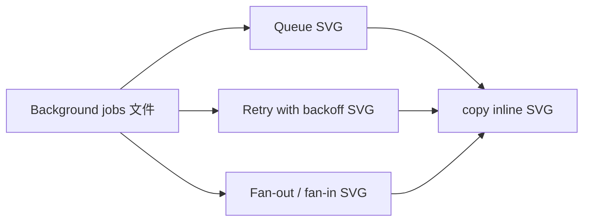

SVG figure sheet 的 SVG 骨架：

```html
<!-- 範例用途：用 inline SVG 畫 queue -> worker -> database 的教學圖。 -->
<svg viewBox="0 0 720 320" role="img" aria-labelledby="queue-title">
  <title id="queue-title">Background job queue flow</title>
  <rect x="40" y="100" width="140" height="72" rx="8" />
  <text x="110" y="140" text-anchor="middle">API enqueue</text>

  <path d="M180 136 H280" marker-end="url(#arrow)" />
  <rect x="280" y="100" width="140" height="72" rx="8" />
  <text x="350" y="140" text-anchor="middle">Redis queue</text>

  <path d="M420 136 H520" marker-end="url(#arrow)" />
  <rect x="520" y="100" width="140" height="72" rx="8" />
  <text x="590" y="140" text-anchor="middle">Worker pool</text>
</svg>
```

Annotated flowchart 的 deploy pipeline：

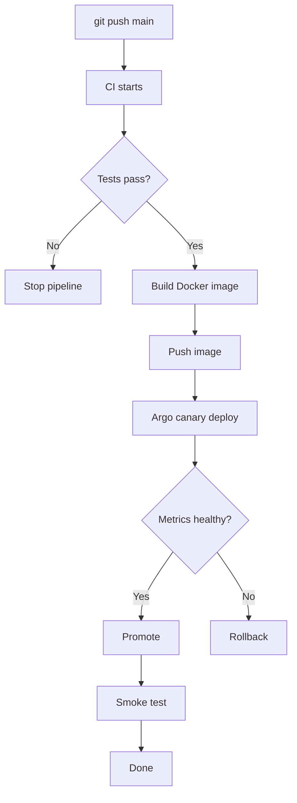

Annotated flowchart 的 workflow 骨架：

```yaml
# 範例用途：把 flowchart 節點對應回 CI 設定。
name: deploy
on:
  push:
    branches: [main]

jobs:
  deploy:
    runs-on: ubuntu-latest
    steps:
      - uses: actions/checkout@v4
      - name: Run tests
        run: npm test
      - name: Build image
        run: docker build -t app:${{ github.sha }} .
      - name: Push image
        run: docker push app:${{ github.sha }}
      - name: Trigger canary
        run: argocd app sync app-canary
```

這兩個範例的分工很清楚：figure sheet 偏「可複製的圖像素材」，flowchart 偏「可排查的流程工具」。前者幫助說明，後者幫助操作。

### 真實工作流程例子

- 工作任務：DevOps pipeline 偶爾部署失敗，新人不知道每一步在跑什麼。
- 你先判斷：這是流程理解與排查問題，適合畫 annotated flowchart。
- 會動到：CI YAML、部署 log、環境名稱、`deploy-flow.html`。
- 資料怎麼流：agent 讀 CI 設定與 log，產生可點擊流程圖，每個節點顯示命令、時間與失敗排查。
- 流程路線圖：

```text
CI 設定 + log -> agent 產生部署流程圖
-> 點擊節點看命令 / log / failure path -> 新人照圖排查
```

- 工作中會寫 / 檢查的片段：

```text
請讀取 .github/workflows/deploy.yml 和最近一次失敗 log。
建立 deploy-flow.html：
- 用流程圖顯示 build、test、publish、deploy、smoke test
- 每個節點點擊後顯示執行命令與常見失敗
- failure path 用紅色標示
```

- 交付前驗證：確認節點順序與 YAML 一致；確認失敗路徑來自真實 log；確認圖例清楚。
- 常見卡點：junior 容易畫出「看起來像流程圖」但沒有排查資訊。

### 範例範圍地圖

| 部分 | 位置 / 檔案 / 指令 / 介面 | 負責的事情 |
| --- | --- | --- |
| 流程來源 | CI YAML、log、部署文件 | 提供真實流程 |
| 圖形呈現 | SVG / HTML flowchart | 顯示流程與分支 |
| 排查內容 | 節點註解、failure path | 告訴新人先查哪裡 |

### 完整實作流程、範例與注意事項

1. 找出流程的事實來源。
2. 請 agent 畫出主要路徑。
3. 補上失敗路徑、命令、log 關鍵字。
4. 用人工抽查每個節點。
5. 把圖放入 runbook 或 PR 說明。

注意事項：圖若不更新會過期，因此要標示來源與產生日期。

### 如果結果和預期不同

如果圖太抽象，要求每個節點加上實際指令、輸入、輸出與失敗時第一個檢查點。

### 當天做完後檢查

- 是否有正常路徑與失敗路徑。
- 是否能對應真實設定。
- 是否能幫新人排查。

### 負面例子 / 錯誤用法

錯誤做法：只畫一張漂亮架構圖，沒有來源。  
問題：讀者不知道圖是否可信。  
修正方向：標出設定檔、log 或程式碼來源。

### 小練習

請 agent 幫你的專案畫「request 從 controller 到 database」的流程圖，並標示錯誤處理。

### Junior 常見誤解

誤以為圖越多越好。好的圖應該回答一個明確問題。

### 一句話總結

Diagram HTML 把流程與關係變成可掃描、可排查的工程地圖。

## Use Case 6：Decks

### 這篇文章主要在講什麼

Decks 類範例展示用一個 HTML 檔做簡報。來源頁面提到，幾個 `<section>` 加一點 JavaScript 就能做 arrow-key slide deck。

### 為什麼需要這個概念

很多內部分享不需要完整簡報工具。HTML deck 可以從 Slack thread、design doc、研究筆記快速變成會議可用的簡報。

### 學完這篇你應該會做到什麼

你應該能請 agent 把一份技術整理轉成可用鍵盤瀏覽的 HTML deck。

### 核心重點

- HTML deck 適合快速內部分享。
- 每頁應該只回答一個重點。
- 不需要 build step，瀏覽器可直接開。

### 來源內部範例整理

| 來源範例 | 範例本體在做什麼 | 頁面怎麼組 | 這個 Case 要學的重點 |
| --- | --- | --- | --- |
| [Arrow-key slide deck](https://thariqs.github.io/html-effectiveness/09-slide-deck.html) | 用 Platform Eng 週會當題目，做一份 6 頁左右鍵切換的 HTML deck。 | 投影片包含 shipped this week、in progress、metrics、decision needed、next week，並把「是否用 feature flag 先 ship recurring tasks」做成會議決策頁。 | Deck artifact 要替會議服務：每頁只承載一個重點，並把需要現場決定的問題突出。 |

#### 範例內文整理：Arrow-key slide deck

這個範例是一份 Platform Eng 週會用的 HTML slide deck。它支援左右鍵切換，頁面底部有進度點，並且用單一 HTML 檔承載整份簡報。

Deck 內容不是把週報塞進投影片，而是把會議節奏切成幾頁：本週 shipped、進行中工作、metrics、需要決策、下週計畫。每一頁都只放一個主題，避免會議中讀者被文字淹沒。

其中最像真實工作的是 decision needed slide。它不是單純報告狀態，而是把「recurring tasks 是否要先用 feature flag 出貨」這個需要現場決定的問題放出來。這讓 deck 不是展示，而是會議工具。

這個範例值得學的是：HTML deck 不需要取代正式文件。它的職責是把既有材料整理成能口頭講、能引導討論、能做決策的順序。

#### 圖示與 code 補充：Decks

Arrow-key slide deck 的簡報結構：

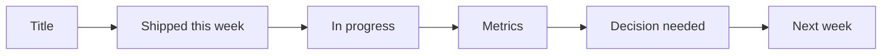

Arrow-key slide deck 的 HTML / JS 骨架：

```html
<!-- 範例用途：不用簡報工具，用單檔 HTML 做內部週會 deck。 -->
<main class="deck">
  <section class="slide is-active">
    <h1>Platform Eng Weekly</h1>
  </section>
  <section class="slide">
    <h2>Shipped this week</h2>
    <ul>
      <li>Recurring task backend behind feature flag</li>
      <li>Queue latency dashboard</li>
    </ul>
  </section>
  <section class="slide">
    <h2>Decision needed</h2>
    <p>Ship recurring tasks to 10% behind feature flag?</p>
  </section>
</main>

<script>
  const slides = [...document.querySelectorAll(".slide")];
  let index = 0;

  window.addEventListener("keydown", (event) => {
    if (event.key === "ArrowRight") index = Math.min(index + 1, slides.length - 1);
    if (event.key === "ArrowLeft") index = Math.max(index - 1, 0);
    slides.forEach((slide, i) => slide.classList.toggle("is-active", i === index));
  });
</script>
```

這個範例的重點不是取代 PowerPoint，而是讓 agent 直接把既有材料整理成「能在會議中講」的節奏。對內部技術分享很有用，因為它省掉簡報工具和 export 步驟。

### 真實工作流程例子

- 工作任務：你要在週會講 10 分鐘 incident learning，但只有 incident doc 和 Slack 討論。
- 你先判斷：這是口頭分享輔助，不是完整報告，所以 deck 要短、重點清楚。
- 會動到：incident doc、Slack 摘要、`incident-learning-deck.html`。
- 資料怎麼流：agent 把原始討論整理成投影片，工程師在會議中用鍵盤展示。
- 流程路線圖：

```text
incident doc + Slack thread -> agent 摘要 -> HTML deck
-> 週會分享 -> follow-up action
```

- 工作中會寫 / 檢查的片段：

```text
請把 incident 文件整理成 8 頁 HTML slide deck：
1. TL;DR
2. Impact
3. Timeline
4. Root cause
5. Detection gap
6. Fix
7. Follow-up
8. Q&A
支援左右鍵切換。
```

- 交付前驗證：確認每頁不塞太多字；確認鍵盤可切換；確認 timeline 和 incident doc 一致。
- 常見卡點：junior 容易把完整報告塞進 slide，每頁太滿。

### 範例範圍地圖

| 部分 | 位置 / 檔案 / 指令 / 介面 | 負責的事情 |
| --- | --- | --- |
| 來源資料 | incident doc、Slack thread | 提供分享內容 |
| Deck | `incident-learning-deck.html` | 會議展示 |
| 後續 | action items | 追蹤改善事項 |

### 完整實作流程、範例與注意事項

1. 決定簡報目標與時間。
2. 要求 agent 控制頁數。
3. 每頁只放一個重點。
4. 加入鍵盤導覽與頁碼。
5. 會前完整跑一次。

注意事項：不要把 deck 當正式 post-mortem；正式紀錄仍應放在團隊指定位置。

### 如果結果和預期不同

如果 slide 太長，要求 agent 每頁限制 3 個 bullet 以內。

### 當天做完後檢查

- 是否能用鍵盤操作。
- 是否頁數符合會議時間。
- 是否保留正確 action items。

### 負面例子 / 錯誤用法

錯誤做法：用 deck 取代正式紀錄。  
問題：會後難以追蹤細節。  
修正方向：deck 用於分享，正式文件用於保存。

### 小練習

把一篇技術筆記轉成 6 頁 HTML deck，限制每頁最多 60 字。

### Junior 常見誤解

誤以為簡報要做得很完整。內部 deck 的核心是幫你講清楚，不是取代完整文件。

### 一句話總結

Deck HTML 是把既有材料快速變成會議可用分享介面的方式。

## Use Case 7：Research & Learning

### 這篇文章主要在講什麼

Research & Learning 類範例包含 feature explainer 和 concept explainer。來源頁面提到 collapsible sections、tabbed code samples、glossary、live ring 等互動能讓學習內容更容易導航。

### 為什麼需要這個概念

學新功能或概念時，長文容易讓人迷路。HTML 可以提供 TL;DR、可展開步驟、分頁程式碼、側邊 glossary、互動示意。

### 學完這篇你應該會做到什麼

你應該能請 agent 讀專案程式碼或概念資料，產出一份可自學的 HTML explainer。

### 核心重點

- 學習文件要能分層閱讀。
- Glossary 可以降低術語門檻。
- 互動示意能幫助理解抽象概念。

### 來源內部範例整理

| 來源範例 | 範例本體在做什麼 | 頁面怎麼組 | 這個 Case 要學的重點 |
| --- | --- | --- | --- |
| [How a feature works](https://thariqs.github.io/html-effectiveness/14-research-feature-explainer.html) | 用 `birchline/api` 的 rate limiting 當題目，讀 `middleware/ratelimit.ts`、`lib/tokenBucket.ts`、`config/limits.yaml`、routes。 | 有 TL;DR、request path、identify caller、bucket lookup、consume token、429 reject、route config 範例、gotchas、FAQ。 | Feature explainer 必須貼著 repo 真實檔案走，讓 junior 知道改設定要碰哪裡、錯誤時看哪裡。 |
| [Concept explainer](https://thariqs.github.io/html-effectiveness/15-research-concept-explainer.html) | 用 consistent hashing 當概念題，說明為什麼比 `hash(key) mod N` 更適合節點會變動的系統。 | 有互動 ring、nodes / keys 控制、移除或新增 node 的效果、和 mod N 的比較表、glossary。 | 概念型 HTML 要先建立直覺，再補正式詞彙；互動視覺化能讓抽象演算法變得可感覺。 |

#### 範例內文整理：How a feature works

這個範例在解釋 `birchline/api` 的 rate limiting。來源頁明確標出它讀了哪些檔案：`middleware/ratelimit.ts`、`lib/tokenBucket.ts`、`config/limits.yaml`、`routes/*.ts`。這讓 explainer 不是通用教科書，而是 repo-specific 文件。

TL;DR 說明每個 request 會根據 caller identity 找到 bucket，再用 token bucket 檢查是否還有額度；沒額度就回 429，成功則繼續進 route handler。

Request path 分成幾步：先 identify caller，例如 user id、api key 或 IP；再 lookup bucket key；接著依 route config 找 limit；然後 consume token；最後成功放行或回 429。頁面也整理 config snippets，讓讀者知道如果要改限制應該去 `limits.yaml`，不是亂改 middleware。

Gotchas 很貼近工作現場：route override 可能蓋過 default limit；burst 和 refill rate 不是同一件事；多 process 或多 region 時如果 bucket 存在記憶體裡，限制可能不一致；測試時要控制時間，不然 token refill 會讓結果飄。

#### 範例內文整理：Concept explainer

這個範例在教 consistent hashing。它先說明問題：如果用 `hash(key) mod N`，當 N 從 4 變 5，很多 key 會重新分配；對 cache 或 shard 來說，這會造成大量 miss 或搬移。

頁面用互動 ring 呈現 hash space。Nodes 和 keys 都被放到 ring 上，每個 key 順時針找到下一個 node。使用者可以調 nodes 和 keys，觀察新增或移除 node 時哪些 key 會移動。

Comparison table 把 modulo hashing 和 consistent hashing 放在一起：mod N 簡單但節點變動時會重排很多 key；consistent hashing 多一點資料結構成本，但節點變動時只影響鄰近區段。Glossary 則解釋 ring、virtual node、replica、hot spot 等術語。

這個範例值得學的是：抽象概念不要一開始就丟公式。先讓讀者看到 key 怎麼移，再用術語命名那個現象。

#### 圖示與 code 補充：Research & Learning

Rate limiter feature explainer 的 request path：

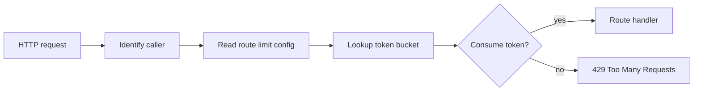

Rate limiter 的設定與 middleware 骨架：

```yaml
# 範例用途：讓不同 route 有不同 rate limit。
defaults:
  burst: 60
  refillPerMinute: 60

routes:
  POST /api/tasks:
    burst: 20
    refillPerMinute: 30
  POST /api/auth/login:
    burst: 5
    refillPerMinute: 5
```

```ts
// 範例用途：依 caller 與 route 判斷是否放行 request。
// 主要輸入：caller key、route config。
// 回傳結果 / 副作用：成功就 next()；失敗回 429。
function rateLimit(config: RateLimitConfig) {
  return async (req: Request, res: Response, next: NextFunction) => {
    const callerKey = identifyCaller(req);
    const routeLimit = config.forRoute(req.method, req.path);
    const bucket = await bucketStore.get(`${callerKey}:${req.path}`, routeLimit);

    if (!bucket.tryConsume(1)) {
      res.status(429).json({ error: "Too many requests" });
      return;
    }

    next();
  };
}
```

Consistent hashing 的資料移動圖：

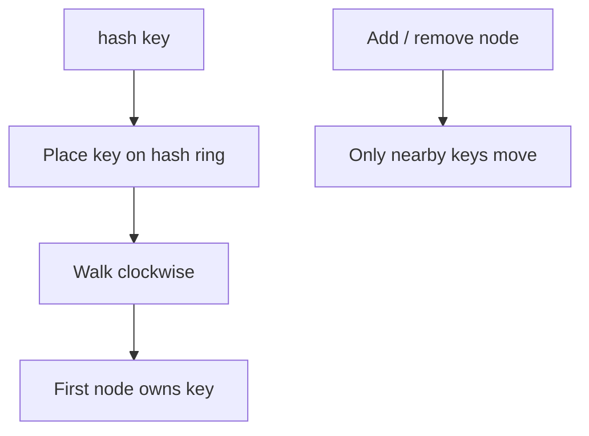

Consistent hashing 的簡化 code 骨架：

```ts
// 範例用途：用 ring 找出某個 key 應該落在哪個 node。
// 主要輸入：key 與已排序的 virtual nodes。
// 回傳結果：負責處理該 key 的 node。
function findOwner(key: string, ring: Array<{ hash: number; nodeId: string }>) {
  const keyHash = hash(key);
  const owner = ring.find((entry) => entry.hash >= keyHash);
  return owner?.nodeId ?? ring[0].nodeId;
}
```

這兩個範例的差別是：feature explainer 要貼近某個 repo 的真實檔案與設定；concept explainer 可以更偏通用概念，但仍要用互動幫讀者建立直覺。

### 真實工作流程例子

- 工作任務：你不懂專案 rate limiter 如何運作，想請 agent 做一份 feature explainer。
- 你先判斷：這是理解既有功能，不是新增功能，所以重點是 request path、設定、限制條件與常見誤解。
- 會動到：rate limiter middleware、設定檔、測試、`rate-limiter-explainer.html`。
- 資料怎麼流：agent 讀程式碼，HTML 展示 request path、config、程式碼片段與 FAQ。
- 流程路線圖：

```text
陌生功能 -> agent 讀 code -> HTML explainer
-> junior 分層閱讀 -> 回到 code 驗證理解
```

- 工作中會寫 / 檢查的片段：

```text
請讀取 rate limiter 相關程式碼，建立 rate-limiter-explainer.html。
請包含：
- TL;DR
- request path 步驟
- tabbed config snippets
- 3 個關鍵程式碼片段註解
- glossary
- FAQ：超量、重試、不同 user 如何計算
```

- 交付前驗證：確認每段 code snippet 來自真實檔案；確認 glossary 不亂定義；確認 FAQ 覆蓋常見問題。
- 常見卡點：junior 容易看懂 explainer 後就以為懂了，沒有回到 code 跑測試確認。

### 範例範圍地圖

| 部分 | 位置 / 檔案 / 指令 / 介面 | 負責的事情 |
| --- | --- | --- |
| 學習來源 | 程式碼、設定、測試 | 提供真實行為 |
| Explainer | HTML feature / concept page | 分層呈現概念 |
| 驗證 | 跑測試、查 log、讀原始碼 | 確認理解不是幻覺 |

### 完整實作流程、範例與注意事項

1. 指定要理解的功能或概念。
2. 要求 agent 讀相關檔案。
3. 產出 TL;DR、流程、code snippet、glossary、FAQ。
4. 讀完後回到原始碼抽查。
5. 用一個小測試或情境題驗證理解。

注意事項：學習 artifact 要標示來源檔案，否則很難知道可信度。

### 如果結果和預期不同

如果 explainer 太像百科，要求它加入「本 repo 的實際檔案、設定與 request path」。

### 當天做完後檢查

- 是否有分層閱讀。
- 是否有真實程式碼來源。
- 是否能回答常見問題。

### 負面例子 / 錯誤用法

錯誤做法：問 agent「解釋 rate limiting」但不讓它讀 repo。  
問題：得到的是通用知識，不是專案行為。  
修正方向：明確指定讀取檔案與測試。

### 小練習

請 agent 幫你整理一個陌生 middleware，產出 HTML explainer，並加入 glossary。

### Junior 常見誤解

誤以為概念懂了就等於會改。實務上還要知道專案中入口、設定與測試在哪裡。

### 一句話總結

Research HTML 把學習內容變成可以分層探索、回到程式碼驗證的導覽頁。

## Use Case 8：Reports

### 這篇文章主要在講什麼

Reports 類範例包含 weekly status 和 incident timeline。來源頁面指出，週報、post-mortem 這種 recurring documents 很適合加上結構、顏色、圖表與時間線。

### 為什麼需要這個概念

報告最怕變成大家略過的長文。HTML 可以用狀態顏色、小圖表、timeline、log excerpts、follow-up checklist 讓讀者快速抓重點。

### 學完這篇你應該會做到什麼

你應該能把週報或 incident report 轉成一份可掃描、可追蹤、可分享的 HTML。

### 核心重點

- Report 要服務讀者決策。
- Timeline 適合 incident。
- Status chart 適合週報。
- Follow-up checklist 要清楚可追蹤。

### 來源內部範例整理

| 來源範例 | 範例本體在做什麼 | 頁面怎麼組 | 這個 Case 要學的重點 |
| --- | --- | --- | --- |
| [Weekly status](https://thariqs.github.io/html-effectiveness/11-status-report.html) | 用 Engineering Status Week 11 當題目，整理 PR merged、deploys、incident、flaky tests、highlights、shipped、velocity、carryover。 | 先給數字摘要，再列 highlights、shipped PR table、PRs per day 圖、in review / blocked / slipped。 | 週報要讓讀者快速知道「發生什麼、風險在哪、下週要追什麼」，不是列流水帳。 |
| [Incident timeline](https://thariqs.github.io/html-effectiveness/12-incident-report.html) | 用 INC-2025-0412「task sync 502」當題目，說明 config rollout 把 sync-worker pool limit 從 64 降到 8，導致 47 分鐘異常。 | 有 TL;DR、minute-by-minute timeline、root cause、impact 指標、action items、owner 和 due date。 | Incident report 要把時間線、根因、影響和後續行動綁在一起，讓團隊能學到如何避免下一次。 |

#### 範例內文整理：Weekly status

這個範例是 Engineering Status Week 11。頁面最上方先放重點數字，例如 merged PRs、deploys、incident、flaky tests，讓主管或團隊成員不用讀完整報告就知道本週狀態。

Highlights 區整理本週真正重要的進展，例如某個功能完成、某個 infra 改善、某個測試穩定化。Shipped table 則列 PR 或功能名稱、owner、狀態和影響。這比單純列 commit 更有用，因為讀者能看出交付物和責任人。

Velocity 圖讓讀者看到一週內 PR 分布，不只是總數。In review、blocked、slipped、carryover 則讓狀態報告不只報喜，也把風險攤開。這種週報的價值在於讓團隊下週能調整優先級，而不是只做成果展示。

#### 範例內文整理：Incident timeline

這個範例是 INC-2025-0412「task sync 502」。TL;DR 說明事故原因：一次 config rollout 把 sync-worker pool limit 從 64 降到 8，造成 `/api/sync` 502，影響持續 47 分鐘。

Timeline 以分鐘為單位列出事件：何時開始 deploy、何時 error rate 上升、何時 alert 觸發、何時 rollback、何時恢復。這種 minute-by-minute timeline 很適合 post-mortem，因為它讓團隊看見 detection、mitigation、recovery 的時間差。

Impact 區列出 502 rate、受影響使用者、同步延遲、retries 等指標。Root cause 把「設定變更」和「沒有足夠 guardrail」連在一起，不只停在誰改錯。Action items 則有 owner 和 due date，例如加 config validation、調整 alert、補 load test。

這個範例值得學的是：incident report 的結論不應只是「下次小心」。它要把事實、根因、影響、修正行動變成可追蹤清單。

#### 圖示與 code 補充：Reports

Weekly status 的資訊架構：

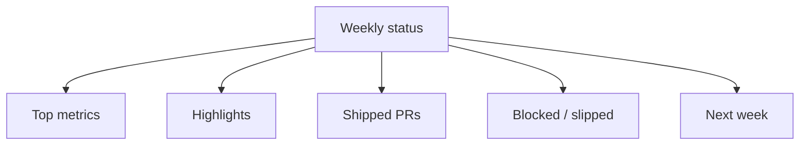

Weekly status 的資料整理骨架：

```md
<!-- 範例用途：把週報資料整理成可掃描結構。 -->
## Engineering Status - Week 11

### Metrics
- PRs merged: 18
- Deploys: 4
- Incidents: 1
- Flaky tests: 3

### Shipped
| Item | Owner | Impact |
| --- | --- | --- |
| Queue latency dashboard | Platform | Faster incident diagnosis |

### Blocked / Slipped
| Item | Blocker | Needed decision |
| --- | --- | --- |
| Recurring tasks rollout | Feature flag ramp | Ship to 10% or wait |
```

Incident timeline 的時間線：

```mermaid
timeline
  title INC-2025-0412 Task sync 502
  10:02 : Config rollout starts
  10:08 : 502 rate increases
  10:14 : Alert fires
  10:22 : Pool limit regression found
  10:31 : Rollback starts
  10:49 : Error rate normal
```

Incident report 的 action item 骨架：

```md
<!-- 範例用途：讓 post-mortem 的 follow-up 可追蹤。 -->
| Action item | Owner | Due date | Verification |
| --- | --- | --- | --- |
| Add config validation for worker pool minimum | Platform | 2026-05-17 | CI rejects pool < 32 |
| Add alert for sync 502 rate | SRE | 2026-05-14 | Alert fires in staging drill |
| Add load test for sync-worker config | QA | 2026-05-21 | Load test included in release checklist |
```

這兩個範例的共同點是都在幫讀者「快速掌握狀態」。週報偏決策與優先級，incident report 偏時間線、原因、影響與追蹤修正。

### 真實工作流程例子

- 工作任務：你要向主管說明本週 shipped、slipped、blocked 的工作。
- 你先判斷：主管不需要所有 commit，需要快速理解進度、風險與需要協助的地方。
- 會動到：Linear tickets、PR list、部署狀態、`weekly-status.html`。
- 資料怎麼流：agent 整理 tickets 與 PR，HTML 顯示 status、圖表與 blocked items。
- 流程路線圖：

```text
tickets + PR + deploy status -> agent 彙整 -> HTML weekly report
-> 主管掃描風險 -> 決定協助或調整優先級
```

- 工作中會寫 / 檢查的片段：

```text
請建立 weekly-status.html：
- 分成 Shipped / Slipped / Blocked / Next
- 加一個小圖表顯示各類數量
- Blocked items 要列出 owner 和需要決策
- 最後加 follow-up checklist
```

- 交付前驗證：確認 ticket 狀態正確；確認 blocked item 有 owner；確認圖表數字和清單一致。
- 常見卡點：junior 容易把週報寫成流水帳，而不是幫主管做決策。

### 範例範圍地圖

| 部分 | 位置 / 檔案 / 指令 / 介面 | 負責的事情 |
| --- | --- | --- |
| 來源資料 | tickets、PR、部署狀態、log | 提供報告事實 |
| 報告頁 | `weekly-status.html` / incident report HTML | 呈現重點與時間線 |
| 後續追蹤 | checklist、owner、due date | 確保報告有行動 |

### 完整實作流程、範例與注意事項

1. 定義報告讀者。
2. 收集事實資料。
3. 要求 agent 產生可掃描 HTML。
4. 檢查數字與狀態。
5. 明確列出 follow-up。

注意事項：報告內容若會外流，要先移除敏感 ticket、客戶資料與內部 log。

### 如果結果和預期不同

如果報告太像流水帳，要求 agent 改成「決策摘要 + 風險 + 需要協助」。

### 當天做完後檢查

- 是否有摘要。
- 是否有 owner。
- 是否有 follow-up。

### 負面例子 / 錯誤用法

錯誤做法：把所有 ticket 全列出。  
問題：讀者看不到重點。  
修正方向：依狀態分組，突出風險與決策。

### 小練習

把你本週做的 5 件事整理成 HTML status report，限制主管 2 分鐘內能看懂。

### Junior 常見誤解

誤以為報告越詳細越專業。真正好的報告會讓讀者知道現在狀態與下一步。

### 一句話總結

Report HTML 把週報與事故報告變成可掃描、可追蹤、可行動的文件。

## Use Case 9：Custom Editing Interfaces

### 這篇文章主要在講什麼

Custom Editing Interfaces 類範例包含 ticket triage board、feature flag editor、prompt tuner。來源頁面說，有些事情很難只靠文字描述，這時可以請 agent 做一個一次性 editor，最後用 export button 把結果轉回 Markdown、diff、JSON 或 prompt。

### 為什麼需要這個概念

有些任務本質上是操作問題，不是寫作問題。例如拖拉 tickets、切換 flags、調 prompt template。如果你只在文字框描述，來回成本很高。

### 學完這篇你應該會做到什麼

你應該能請 agent 針對單一工作建立 throwaway editor，並把操作結果匯出回正式流程。

### 核心重點

- Editor 是為當下任務服務，不一定要重複使用。
- 一定要有 export button。
- 輸出格式要能貼回 agent、PR、issue 或設定檔。

### 來源內部範例整理

| 來源範例 | 範例本體在做什麼 | 頁面怎麼組 | 這個 Case 要學的重點 |
| --- | --- | --- | --- |
| [Ticket triage board](https://thariqs.github.io/html-effectiveness/18-editor-triage-board.html) | 用 Cycle 14 triage 當題目，把 24 張 Linear tickets 預先分到 Now / Next / Later / Cut，讓使用者拖拉調整。 | 有拖拉欄位、tag filter、reset、copy as markdown。 | 一次性 editor 要讓人能操作資料，並把最後排序匯出回 planning doc。 |
| [Feature flag editor](https://thariqs.github.io/html-effectiveness/19-editor-feature-flags.html) | 用 `flags.production.json` 當題目，做 form-based feature flag editor。 | 有 toggles、dependency warning、pending changes、copy diff、copy full JSON、reset。 | 設定編輯器不要直接改 production，先幫人看 dependency 和產生 diff，交給正式流程 review。 |
| [Prompt tuner](https://thariqs.github.io/html-effectiveness/20-editor-prompt-tuner.html) | 用 support reply draft prompt 當題目，左側編輯 system prompt，右側用三組真實 sample tickets 即時預覽。 | 有 template、available slots、live preview、unknown field highlight、copy prompt。 | Prompt 調整不是只改文字，要用多組 sample input 同時驗證，避免只對單一案例有效。 |

#### 範例內文整理：Ticket triage board

這個範例是 Cycle 14 triage board。它把 24 張 Linear tickets 預先分到 Now、Next、Later、Cut 四欄，讓使用者可以直接拖拉改排序。

每張卡片不是只有 title，而是會顯示 area、impact、effort、risk 或 tag。這讓 prioritization 不只靠感覺，而是能在拖拉時看到判斷依據。頁面還有 tag filter，方便先看某個領域的 tickets。

最重要的是 export：copy as markdown 會把每欄最後排序和一句 rationale 匯出。這代表操作結果不會困在 HTML 裡，而是能貼回 planning doc 或 Linear comment。

#### 範例內文整理：Feature flag editor

這個範例用 `flags.production.json` 做 feature flag editor。它把 flags 依 area 分組，讓使用者用 toggle 開關，並即時顯示 pending changes。

Dependency warning 是這個範例的關鍵。例如某個 flag 需要 prerequisite flag 先開，如果使用者開了 dependent flag 但 prerequisite 沒開，頁面會警告。這比直接編 JSON 安全，因為它把隱含規則顯示出來。

輸出方式也很克制：copy diff、copy full JSON、reset。它沒有直接打 production API，因為一次性 HTML editor 不應該繞過正式審核流程。它的任務是幫你產生可 review 的變更。

#### 範例內文整理：Prompt tuner

這個範例用 support reply draft prompt 當題目。左側是 system prompt / template，可編輯並標出 variable slots；右側有三組 sample tickets，會即時顯示填入 template 後的輸出。

頁面會 highlight unknown field，避免 prompt 裡用了不存在的變數。它也會顯示不同 sample input 對 prompt output 的影響，讓你不要只針對一個 ticket 調到很好，卻讓其他情境變差。

最後的 copy prompt button 能把調整後版本帶回正式 prompt 檔或 agent 對話。這個範例的核心是：prompt tuning 要像測試 UI 一樣，用多組樣本即時驗證。

#### 圖示與 code 補充：Custom Editing Interfaces

Ticket triage board 的操作流程：

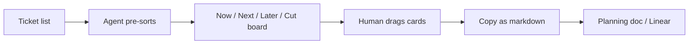

Ticket triage board 的 drag card 骨架：

```html
<!-- 範例用途：讓 ticket 可以被拖拉排序，最後再匯出 markdown。 -->
<section class="lane" data-lane="now">
  <h3>Now</h3>
  <article class="ticket-card" draggable="true" data-ticket-id="LIN-128">
    <strong>LIN-128 Fix sync retry loop</strong>
    <span>impact: high</span>
    <span>effort: medium</span>
  </article>
</section>
```

Feature flag editor 的 dependency 圖：

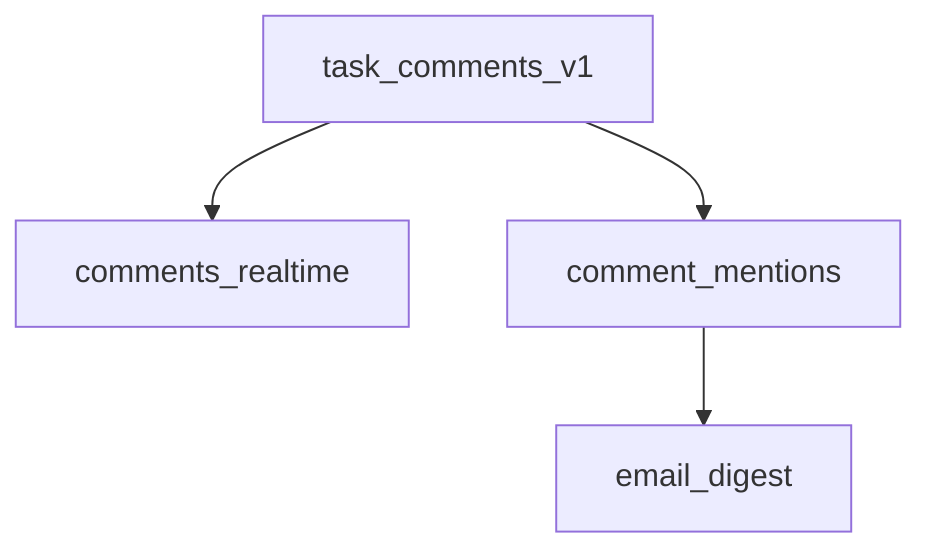

Feature flag editor 的 JSON / diff 骨架：

```json
{
  "task_comments_v1": true,
  "comments_realtime": true,
  "comment_mentions": false,
  "email_digest": false
}
```

```diff
{
  "task_comments_v1": true,
- "comments_realtime": false,
+ "comments_realtime": true,
  "comment_mentions": false
}
```

Prompt tuner 的驗證流程：

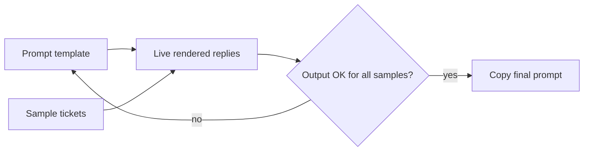

Prompt tuner 的 prompt template 骨架：

```text
你是客服回覆助手。

請根據以下 ticket 草擬回覆：
- 使用者問題：{{ticket.summary}}
- 目前狀態：{{ticket.status}}
- 可提供的補償或限制：{{policy.allowed_action}}

要求：
1. 語氣要清楚、尊重、不過度承諾。
2. 如果缺少必要資訊，請先詢問。
3. 不要提到內部系統欄位名稱。
```

這三個範例是整個頁面最像「工具」的部分。重點不是要長期維護，而是把一次性編輯工作變成可操作介面，最後一定要匯出成正式流程能接住的格式。

### 真實工作流程例子

- 工作任務：你要重新排序 30 張 Linear tickets，分成 Now / Next / Later / Cut。
- 你先判斷：這是排序與取捨問題，拖拉介面比文字清單更直覺。
- 會動到：ticket 清單、priority 規則、`triage-board.html`、匯出的 Markdown 排序。
- 資料怎麼流：agent 讀 ticket 清單並預排序，使用者拖拉調整，HTML 匯出 Markdown，貼回 Linear 或規劃文件。
- 流程路線圖：

```text
ticket list -> agent 預排序 -> HTML drag board
-> 人調整 -> copy markdown -> 貼回 planning doc / Linear
```

- 工作中會寫 / 檢查的片段：

```text
請建立 triage-board.html：
- 四欄：Now / Next / Later / Cut
- 每張卡片顯示 title、impact、effort、risk
- 先依你的判斷預排序
- 支援拖拉
- 加 copy as markdown 按鈕，輸出每欄排序與一句理由
```

- 交付前驗證：確認拖拉後順序會更新；確認 copy 出來的 Markdown 可用；確認每張 ticket 沒漏。
- 常見卡點：junior 容易忘記 export，最後操作結果留在瀏覽器裡出不來。

### 範例範圍地圖

| 部分 | 位置 / 檔案 / 指令 / 介面 | 負責的事情 |
| --- | --- | --- |
| 輸入資料 | tickets、feature flags、prompt template | 提供要編輯的內容 |
| Editor | `triage-board.html` / `feature-flags.html` | 提供操作介面 |
| 匯出結果 | Markdown、JSON、diff、prompt | 帶回正式工作流 |

### 完整實作流程、範例與注意事項

1. 定義要編輯的資料形狀。
2. 要求 agent 建立單檔 HTML editor。
3. 明確指定互動方式，例如拖拉、toggle、live preview。
4. 一定要求 export。
5. 把 export 結果貼回正式工具。

注意事項：不要讓 editor 直接修改 production 設定；先匯出 diff，再由人 review。

### 如果結果和預期不同

如果 editor 好玩但無法交付，要求補上 export button，並指定輸出格式。

### 當天做完後檢查

- 是否能操作。
- 是否能匯出。
- 是否沒有直接修改正式資料。

### 負面例子 / 錯誤用法

錯誤做法：做了一個 feature flag editor，按 toggle 後直接打 production API。  
問題：一次性工具缺少權限、審核與 rollback。  
修正方向：只匯出 diff，由正式流程 review 後套用。

### 小練習

把一份 prompt template 做成 HTML prompt tuner，左邊編輯，右邊用 3 組 sample input 即時預覽，最後 copy final prompt。

### Junior 常見誤解

誤以為 editor 一定要做成長期工具。很多時候，一次性、可匯出的 HTML 就足夠。

### 一句話總結

Custom editor HTML 把難以用文字描述的調整變成可操作介面，再把結果匯出回正式工作流。

## HTML Artifact 的操作前檢查

請 agent 產生 HTML 前，先問自己：

- 讀者是誰？
- 讀者看完要做什麼決策？
- 這份 artifact 是否需要互動？
- 來源資料在哪裡？
- 最後要輸出成什麼格式？
- 這份 HTML 是一次性工具，還是要長期維護？

## 通用 Prompt 範本

```text
請產生一個單檔 HTML artifact，不要只輸出 Markdown。

讀者是：[角色]
這份 HTML 要幫他完成：[決策 / review / 學習 / 排序 / 分享]

請讀取或使用以下來源：
- [檔案 / diff / ticket / 設定 / log / 文件]

內容需要包含：
- TL;DR
- 視覺化結構，例如比較表、流程圖、timeline、cards 或 tabs
- 真實工作流程中的輸入、處理、輸出
- 風險或注意事項
- 驗證清單
- 如果有互動，請提供 copy/export button

請避免只做視覺裝飾。重點是讓讀者更快理解、比較、操作或交付。
```

## 端到端流程

```text
工作問題
-> 判斷是否需要比較 / 視覺化 / 互動 / 匯出
-> 提供來源資料給 agent
-> agent 產生單檔 HTML
-> 人用瀏覽器閱讀或操作
-> 抽查來源資料
-> 匯出結果
-> 回到 PR / issue / 文件 / 設定流程
```

## 做完後檢查

- HTML 能否直接用瀏覽器開啟。
- artifact 是否明確標示讀者與用途。
- 是否真的比 Markdown 更容易理解。
- 是否有引用來源資料，而不是憑空整理。
- 是否有驗證方式。
- 若有互動，是否能匯出結果。
- 是否避免敏感資訊外洩。
- 是否清楚標示這是一次性 artifact 或正式文件。

## 總結

這個範例集真正重要的訊息是：agent 不只能產生文字，也能產生「工作介面」。當任務需要比較、理解、展示、調參、排序、學習或報告時，HTML artifact 可以讓人更容易留在 loop 裡，而不是把一大段 Markdown 略過。

## 驗證

- 來源連結：已附上。
- Use Case 章節：9 / 9。
- 真實工作流程例子：9 / 9。
- 工作任務欄位：9 / 9。
- 你先判斷欄位：9 / 9。
- 會動到欄位：9 / 9。
- 資料怎麼流欄位：9 / 9。
- 流程路線圖欄位：9 / 9。
- 工作中會寫 / 檢查的片段欄位：9 / 9。
- 交付前驗證欄位：9 / 9。
- 常見卡點欄位：9 / 9。
- 範例範圍地圖：9 / 9。
- 完整實作流程：9 / 9。
- 負面例子：9 / 9。
- 小練習：9 / 9。
- Junior 常見誤解：9 / 9。
- 一句話總結：9 / 9。
